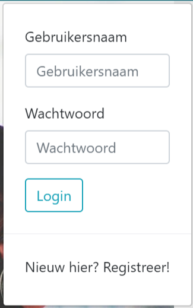
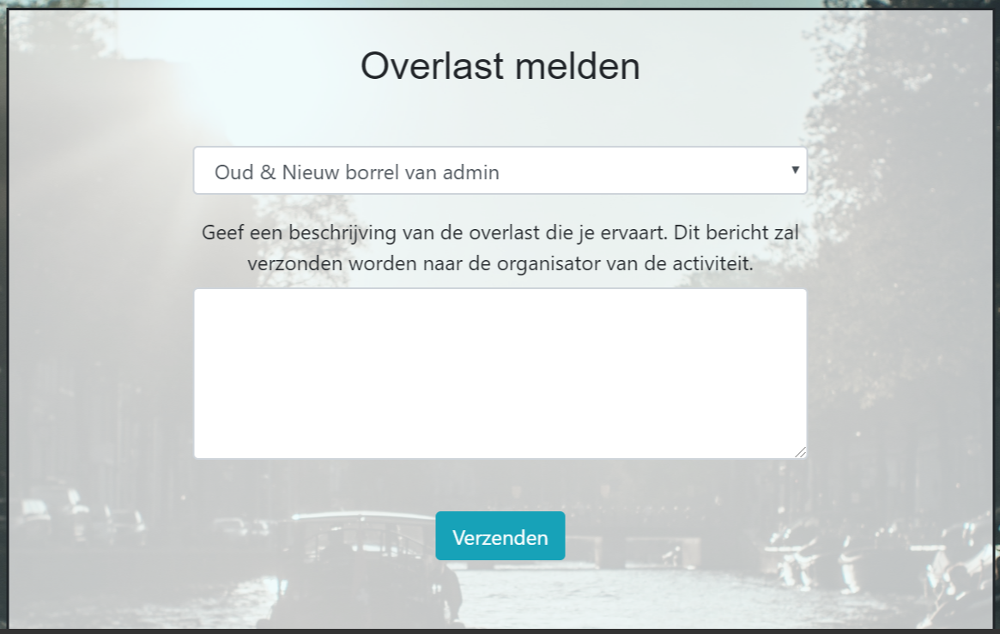

# Final Project - technical overview

#### Index
*Dit is de eerste pagina die een gebruiker te zien krijgt en fungeert als homepage.*

url: /'' 
functie: socialieven.views. 
functionaliteit: 
**Inloggen/registreren** 

    

#### Activiteiten 
*Deze pagina geeft een overzicht van alle activiteiten die zijn gecreëerd door alle gebruikers.*

url: /activiteiten 
functie: socialieven.views.activiteiten 
functionaliteit: 
**Activiteiten weergeven** 

    

**Aanmelden** 
*Een gebruiker kan zich voor een activiteit aanmelden, door op de 'aanmelden'-knop te klikken.* 
url: /aanmelden/id 
functie: socialieven.views.aanmelden 
**Afmelden** 
*Wanneer een gebruiker is aangemeld voor een activiteit, kan hij/zich zich afmelden door op de 'afmelden'-knop te klikken.* 
url: /afmelden/id 
functie: socialieven.views.afmelden 
**Overlast** 
*Een gebruiker kan op de 'overlast'-knop klikken, om overlast te melden van een activiteit. De gebruiker komt op een pagina waarop een formulier ingevuld moet worden, dat vervolgens per mail verzonden wordt aan de organisator van de betreffende activiteit.* 
url: /overlast/id 
functie: socialieven.views.overlast 
functionaliteit: 
**Overlast melden** 

    

#### Nieuwe activiteit 
*Door middel van een formulier, kan een gebruiker een activiteit creëren, die vervolgens wordt weergegeven op de 'activiteiten'-pagina.*

url: /nieuwe_activiteit 
functie: socialieven.views.nieuwe_activiteit 
**Nieuwe activiteit creëren** 

#### Profiel 
*Op deze pagina ziet een gebruiker zijn/haar persoonlijke informatie.*

url: /profiel 
functie: users.views.profiel 
functionaliteit: 
**Persoonlijke informatie bekijken** 