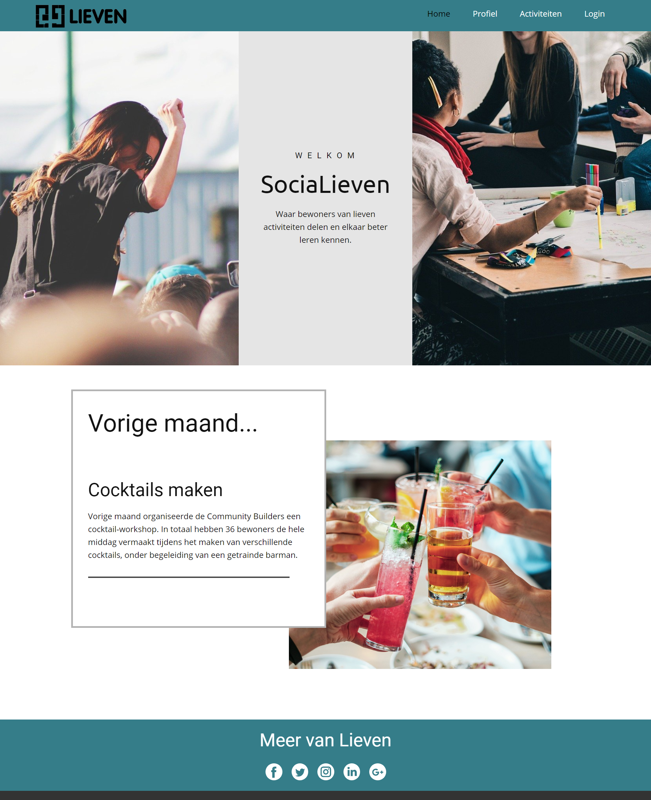
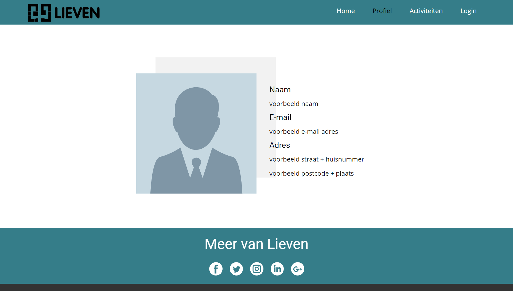
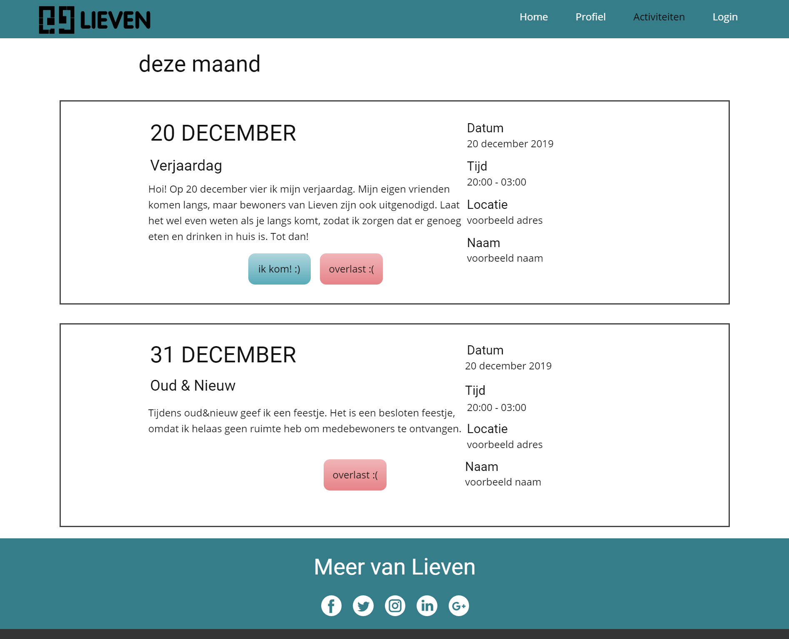

# Final Project

## Probleem
Wonen in een studentencomplex gaat vaak gepaard met feestjes en de bijbehorende geluidsoverlast. Doordat je vaak niet weet waar het geluid vandaan komt en/of de persoon die je zou moeten aanspreken niet kent, kan het lastig zijn om het probleem op te lossen. Het gevolg hiervan is dat je eigen irritaties oplopen en de organisator van het feestje zich wellicht van geen kwaad bewust is.

## Oplossing
Om bovenstaand probleem op te lossen, ga ik een platform maken waarop bewoners evenementen kunnen creëren en waarop eventuele geluidsoverlast aangegeven kan worden, zodat er een duidelijk overzicht is van activiteiten en zodat de communicatie tussen bewoners makkelijker gemaakt wordt.

### Minimum viable product
* **Registreren, inloggen, uitloggen**
    * Een bewoner moet zich registreren met voornaam, achternaam, email, adres en wachtwoord.
    * Een bewoner kan inloggen met email en wachtwoord.
        * Wanneer een bewoner niet is ingelogd, is slechts een klein deel van de webpagina zichtbaar.
    * Een bewoner kan uitloggen.
* **Activiteiten**
    * Een bewoner kan een activiteit creëren, die vervolgens zichbaar wordt op de website.
        * Op één pagina zijn alle activiteiten te zien, gesorteerd op datum.
    * Een activiteit bevat minimaal de volgende informatie:
        * Onder welke categorie valt de activiteit, bijvoorbeeld 'verjaardag', 'filmavond', 'overig'.
        * Datum, tijd en locatie.
        * Zijn medebewoners wel of niet uitgenodigd.
    * Wanneer medebewoners zijn uitgenodigd, kan een bewoner zich via een knop aanmelden en afmelden voor de activiteit.
    * Minimaal één admin kan gecreëerde activiteiten aanpassen.
* **Overlast**
    * Bij een activiteit staat een 'overlast'-knop.
    * Wanneer op deze knop wordt geklikt:
        * Krijgt de gebruiker een scherm te zien waarin een bericht geschreven en verstuurd kan worden.
        * Dit bericht wordt gemaild naar de organisator van de betreffende activiteit.

### Optionele features
* Op de website kan gezocht worden naar en gefilterd worden op bepaalde activiteiten.
* Een bewoner heeft een eigen pagina met daarop een overzicht van de gemaakte activiteiten en de activiteiten waarvoor de persoon zich heeft aangemeld.
* Bij het creëren van een activiteit kan gekozen worden hoeveel mensen zich kunnen aanmelden.
    * Op het moment dat dit aantal is bereikt, wordt de activiteit als 'vol' weergegeven en kan er niet meer aangemeld worden.
* Onder een activiteit kunnen berichten worden achtergelaten, zodat er bijvoorbeeld vragen gesteld kunnen worden.
* Een bewoner kan zijn/haar eigen activiteiten aanpassen nadat ze zijn gepubliceerd.
* Wanneer iemand een 'overlast'-bericht heeft ontvangen, kan die persoon hier op reageren. 

## Ontwerp
### Index

### Profiel

### Activiteiten

## Prerequisites
### Data sources
Waarschijnlijk zal ik geen data gebruiken vanuit externe bronnen. De data die uiteindelijk op de website te vinden is, zal toegevoegd worden door gebruikers. Het betreft onder andere de gegevens van gebruikers en de activiteiten die door gebruikers worden gecreëerd. 

### External component
* Django - Zal gebruikt worden voor inloggen, uitloggen en beheren van data door minimaal één superuser.
* SQLite - Deze database wordt standaard gebruikt door Django en is dus het meest voor de hand liggend om te gebruiken.
* Bootstrap - Zal gebruikt worden voor een groot deel van de layout.

### Similar web apps
Waarschijnlijk komt **Facebook** het meest in de buurt van mijn idee. Op Facebook is het ook mogelijk om groepen en evenementen aan te maken, maar het kent echter veel nadelen met betrekking tot mijn idee.
* Om op de hoogte te zijn van alle medebewoners, moet iedereen elkaar als 'vriend' toevoegen. Dit is allereerst voor iedere bewoner ontzettend veel werk, waardoor de kans klein is dat iedereen het daadwerkelijk zal doen. Daarnaast weten veel bewoners niet van elkaars bestaan, waardoor ze elkaar ook niet op Facebook kunnen opzoeken.
* Een beheerder zou iedereen kunnen toevoegen aan een Facebook-groep. Echter, ook alleen de beheerder zal hier vervolgens activiteiten in kunnen delen. Een andere mogelijkheid is dat een bewoner aan privé-evenement creëert en het vervolgens deelt in de groep. Dit is echter omslachtig en mist functionaliteit die ik wel op mijn pagina wil hebben. 

### Hardest parts
* Op dit moment is het moeilijkste naar mijn idee het laten werken van de **'overlast'-knop**. Een bewoner moet een bericht kunnen schrijven, wat vervolgens direct bij de organisator aankomt. Om dit op te lossen, ga ik onderzoeken wat de mogelijkheden zijn om berichten vanuit de website naar een e-mail te versturen.
* Daarnaast zal ik veel met de database moeten werken. Ik zal dus goed moeten nadenken over hoe ik deze informatie wil verzamelen en opslaan.