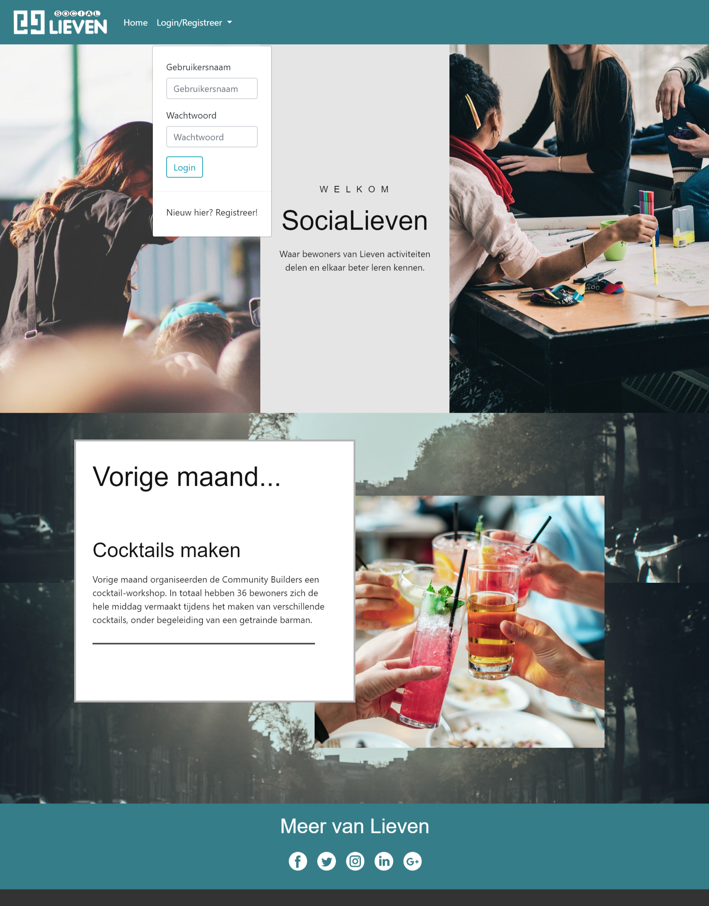

# Final Project - SociaLieven

## Probleem
Wonen in een studentencomplex gaat vaak gepaard met feestjes en de bijbehorende geluidsoverlast. Doordat je vaak niet weet waar het geluid vandaan komt en/of de persoon die je zou moeten aanspreken niet kent, kan het lastig zijn om het probleem op te lossen. Het gevolg hiervan is dat je eigen irritaties oplopen en de organisator van het feestje zich wellicht van geen kwaad bewust is.

## Oplossing
Om bovenstaand probleem op te lossen, heb ik een platform gemaakt waarop bewoners evenementen kunnen creëren en waarop eventuele geluidsoverlast aangegeven kan worden, zodat er een duidelijk overzicht is van activiteiten en zodat de communicatie tussen bewoners makkelijker gemaakt wordt.

## Ontwerp
### Index

### Profiel

### Activiteiten
